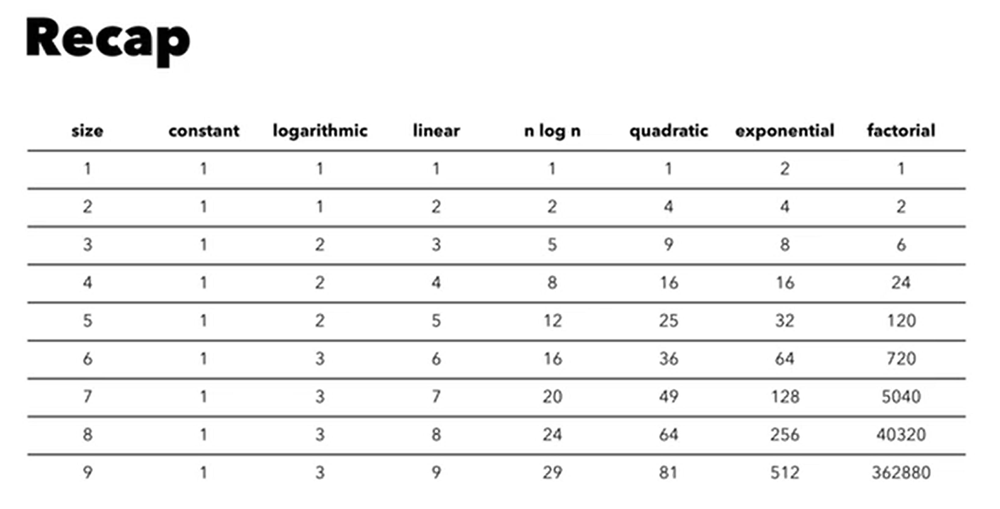

# Algorithms
- Clear and complete set of instruction to solve a problem
- predictable and reliable outcome
- abstract concept, independent of where it is executed (paper, code)

##Complexity analysis and big O notation
- given an algorithm how does the number of operations to reach a solution change as its size increases
- Complexity analysis studies the `time` (i.e. number of operations) and `space` (i.e. amount of storage required) complexity of a given algorithm.
- It describes a dynamic property, it focuses on how the complexity changes as the size of the problem changes.
- It considers the best, average (expected), and worst case scenario.
- Big O notation is a method to annotate complexity. It typically considers the worst case (which often coincides with the average case).

##Constant complexity
- it does not change as the size increases
- It’s written as O(k) or O(1).
- It’s independent of the size of the problem.
- Examples are accessing an item in an array, and reading from or writing to a hash table.
- holy grail of any algorithm as scaling is not an issue

##Logarithmic complexity
- It’s written as O(log n).
- It grows by one each time the size of the problem doubles.
- great for sorting large amounts of data
- An example is searching an item in a binary search tree (unless it’s very unbalanced).

##Linear complexity
- It’s written as O(n).
- It grows proportional to the size of the problem.
- Examples are for loops, and searching for an item in an array or a linked list.

##N log n complexity
- It’s written as O(n log n).
- It grows “log n” times linear to the size of the problem (aka linearithmic).
- combines logarithmic and linear complexity combined
- An example is the merge sort algorithm.

## Quadratic complexity
- It’s written as O(n^2).
- It grows squared to the size of the problem.
- An example is a for loop inside another one.

## Exponential complexity
- It’s written as O(2^n).
- It doubles each time the size of the problem increases by one.
- different from quadratic as in quadratic size determines the base. but here size determines the exponent. which is worse.
- opposite of logarithmic 
- An example is generating all possible combinations from a list of elements (without repetitions).

## Factorial complexity
- It’s written as O(n!).
- It grows factorial to the size of the problem.
- An example is generating all possible permutations from a list of elements (without repetitions).
- one of the worst cases

## Comparison

