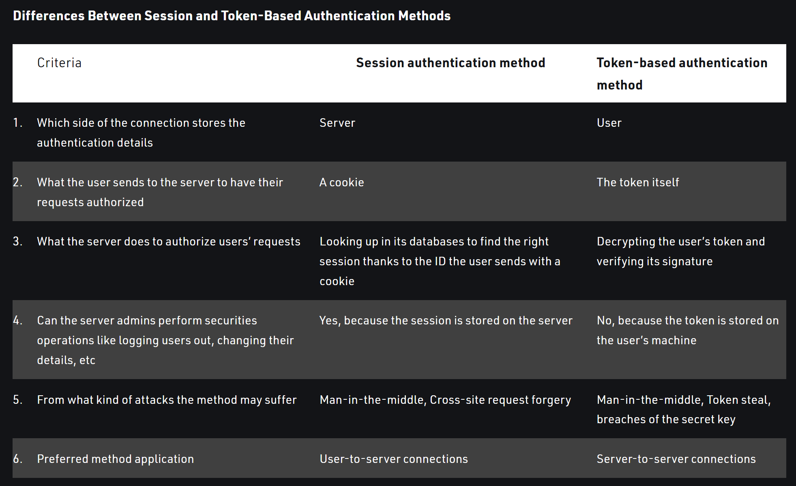

# Authentication
- authentication - who are you
- authorization - what can you do

## What is authentication
- The purpose of authentication is to allow access to a resource only to some users (thus restricting it from the rest).
- Authentication verifies who you are. Authorization verifies what you are allowed to do.
- Usually, a connection attempt to a restricted resource needs to be both authenticated and authorized by the system.
- This means that users need to have an account, which is used to verify their identity and permissions against previously stored data.
- Passwords should never be stored in clear text, but rather encrypted with a secure algorithm (e.g. bcrypt).
- The authentication process can be divided in three parts: login, session, and logout.
- When users log into a system, a unique token is returned to them (e.g. a UUID), that can be used as a key to validate the following requests.
- A “session” typically is the combination of this token, its expiry timestamp, and in some cases certain cached user data (e.g. the user id). Sessions are destroyed upon user logout.

## Token validation on the server
- There are two alternatives to handle token validation: stateful or stateless.
- In a stateful approach, the server stores the token locally before returning it to the client. Future requests by the client come with this token, that the server can validate through comparison.
- When using stateful authentication, the most common approaches on the server are to either store the token and its expiry directly as properties of the user entity in the db (indexing the token), or to have a dedicated key-value memory store where the key is the token, and the value is a collection which includes the token expiry and the most relevant user properties (e.g. the user id).
- In a stateless approach instead, the server creates the session, with the token, its expiry and some data about the user (at least the user id), encrypts it, cryptographically signs it, and returns it to the client without storing it locally. Future requests by the client come with this encrypted session, which the server validates by decrypting it and mathematically checking that the data has not been tampered.
- A common implementation of stateless authentication are JSON Web Tokens (aka JWT).
- Generally speaking a stateless paradigm is less secure (because if the encryption algorithm is broken the entire system is at risk), although it’s easier to scale (because there’s no need for a centralized authentication authority).

## Token storage on the server
- Secure communication between client and server should only happen through HTTPS.
- The token in the browser can be stored through cookies or Web Storage.
- The main threats that concern token storage are XSS and CSRF attacks.
- To eliminate at the root the possibility for an XSS attack to steal sensitive information, it needs to be stored where it’s not accessible by JavaScript. This is only possible with HttpOnly cookies.
- Be aware though that cookies expose to CSRF attacks, unless you set the SameSite attribute to strict.
- Sensitive operations should always require manual confirmation of credentials by the user, and not be allowed on automated token validation only (e.g. password change, account deletion / deactivation, financial transactions, bulk operations).
- by storing session in the db we can block or blacklist tokens, forcing user to logout. Cannot do with token as it is only validated on server but stored in browser.

## Token vs Session
[Token vs session based authentication](https://www.geeksforgeeks.org/session-vs-token-based-authentication/#:~:text=The%20main%20difference%20is%20session,one%20the%20client%20stores%20them.)

## OAuth
- Deals with authorization rather than authentication.
- Is a standard that defines a methodology for an app (the “client”) to be able to interact with another app (the “resource server”) on behalf of a user that has an account there (the “resource owner”). For example, when you want an app to be able to access the photos you’ve stored on another app.
- With OAuth, users through their account on the resource server can authorize the client to perform certain operations there (within a defined scope), without the need to share their login credentials (which would instead provide unlimited access to the client).
- Once authorized, the client receives a token from the resource server that can be used to obtain the allowed resources, until it’s revoked from the user.